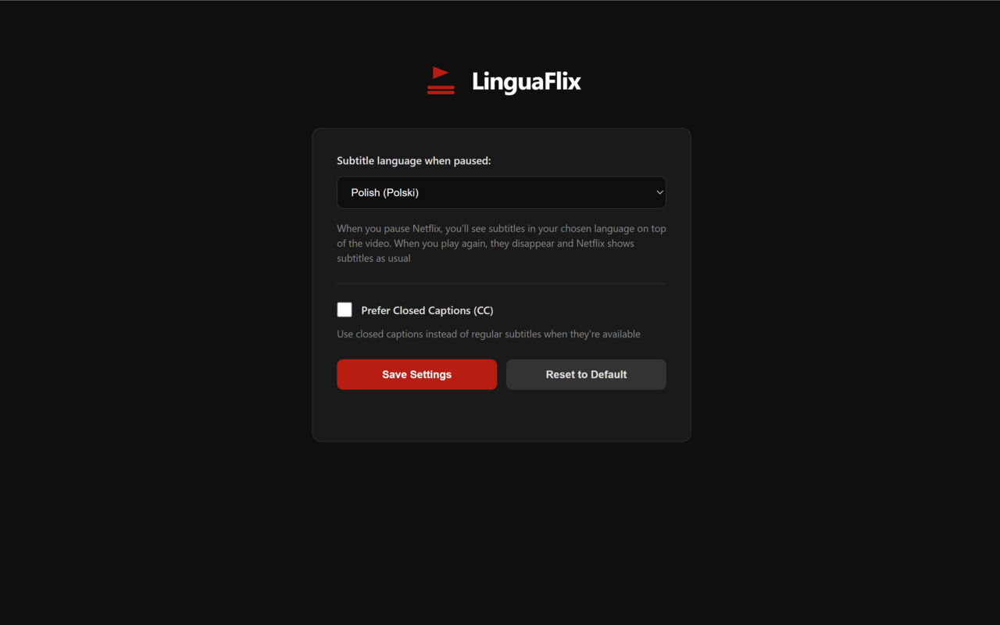

# LinguaFlix

**Pause Netflix to see subtitles in another language.** A Chrome extension for language learners that overlays secondary subtitles when you pause — then disappears when you play.

[](https://chromewebstore.google.com/detail/linguaflix/bllbooanjfhngljkndcaehbojpdhooka)

<p align="center">
  
  <br>
  <em>Pause to see subtitles in your language</em>
</p>
<p align="center">
  
  <br>
  <em>Choose your language in Settings</em>
</p>

## Features

- **Your language on pause** — pause to see subtitles in your native language, play to continue watching normally
- **Works in fullscreen** — the overlay follows fullscreen transitions seamlessly
- **Closed Captions support** — optionally prefer CC tracks when available
- **Private and lightweight** — everything runs locally in your browser, no data leaves your machine. The extension only runs on netflix.com and requires no special permissions

## How It Works

1. Install the extension and pick your native language in Settings
2. Play any Netflix title. Enable subtitles in a foreign language (e.g. English)
3. **Pause** — LinguaFlix shows the subtitle in your native language as an overlay on top of the Netflix player
4. **Play** — the overlay disappears and Netflix continues as normal

Under the hood, the extension detects when Netflix loads subtitle files, parses them, and keeps them ready so the translation appears instantly when you pause.

## Installation

### From the Chrome Web Store

Install [LinguaFlix](https://chromewebstore.google.com/detail/linguaflix/bllbooanjfhngljkndcaehbojpdhooka) directly from the Chrome Web Store — one click, no setup needed.

### From source (developer mode)

1. Clone the repo:
   ```
   git clone https://github.com/msl0/LinguaFlix
   ```
2. Open `chrome://extensions/` in Chrome
3. Enable **Developer mode** (top-right toggle)
4. Click **Load unpacked** and select the `src/` directory
5. Open the extension popup and go to **Settings** to choose your language

## FAQ

**Which languages are available?**<br>
LinguaFlix shows whatever subtitle tracks Netflix provides for a given title. If Netflix doesn't offer subtitles in your chosen language for a specific show, there's nothing to display.

**Does this work with other streaming services?**<br>
No — LinguaFlix is built specifically for Netflix.

**Why pause-based instead of always-on dual subtitles?**<br>
Showing two subtitle tracks simultaneously is visually noisy and hard to read. Pause-to-reveal gives you a clean reading experience without disrupting the flow of watching.

**I paused but no subtitle appeared — what's wrong?**<br>
LinguaFlix can only show subtitles that Netflix provides. If the title you're watching doesn't have a subtitle track in your chosen language, there's nothing to display. Try a different show or check which languages Netflix offers for that title. If the problem persists, [open a bug report](https://github.com/msl0/LinguaFlix/issues/new?template=bug_report.yml).

## Contributing

Found a bug? Have an idea for a new feature? I'd love to hear from you — just [open an issue](https://github.com/msl0/LinguaFlix/issues/new/choose) and tell us what happened or what you'd like to see.

If you'd like to contribute code, please open an issue first to discuss what you'd like to change.

## License

[MIT](LICENSE)
